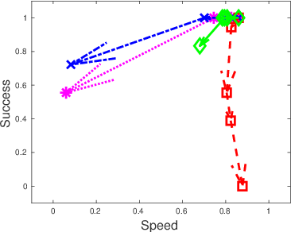

POETICON++ simulated symbolic reasoner
======================================

Below are the instructions on how to run the **simulated symbolic reasoner** (to test **probabilistic planning** under noisy conditions and with different heuristics).

## Installation

* compile yarp with Python 3 support (see http://www.yarp.it/yarp_swig.html and https://github.com/robotology/yarp/issues/1149)

* configure the poeticon repository (https://github.com/robotology/poeticon) with the CMake option `BUILD_simulation` set to `ON`. Compile and `make install`

## Configuration


simple3 scenario           |  complex6 scenario
:-------------------------:|:-------------------------:
  |  

* choose an initial visual scenario, e.g., simple3 or complex6, let's call it `$SCENARIO`

* choose a planner heuristic configuration among:
  - no heuristics
  - creativity
  - adaptability
  - creativity and adaptability

The above choices determine which application XML from `poeticon-simulation/app/scripts`
will be used, for example:
`sim_complex6_creativity+adaptability.xml`

* choose the types and amounts of simulated noise and set them in the poeticon
context directory (obtained by: `yarp-config context --where poeticon`). In there,
create a symbolic link with the name `dummy_activity_$SCENARIO.ini` (e.g.,
`dummy_activity_complex6.ini`), which should link to one of the existing noise
definitions. For example:
  `ln -s dummy_activity_complex6_onearm_050.ini dummy_activity_complex6.ini`

Note: the numbers at the end of the filename, and inside it, refer to the
_reliability_, which is the opposite of noise, i.e., (1 - noise)

Note: the name of the link must correspond to the `--from` argument as defined in the XML next to the `dummyActivityInterface` module

## How to run

* in a terminal, start `yarpserver`

* in a terminal, start `yarprun --server /enigma` (this is the name of the yarprun server used during experiments; if you want to change it, change the variable `yarprun_port` in the Python script as well)

* in a terminal, start `yarpdataplayer`, open the chosen scenario (e.g., simple3
or complex6), select Options->Repeat, then reproduce

* in a terminal, call the Python script `simpoeticon.py` with the number of
desired experimental episodes next to the `-n` option, for example:
`./simpoeticon.py -n 50`

* to see other options, call `./simpoeticon.py --help`

* the output of each experimental episode will be printed with the sequence of motor actions and the corresponding metrics data structure `ex(#good,#total[,success])`, where `#good` is the number of successful motor actions, `#total` is the number of total attempted motor actions including failed ones, `success` is a boolean indicating whether the system attained the goal autonomously or not (this boolean is only printed when its value is `fail` i.e. false). Example output:
```
Starting experiment 1/20
[...]
Result of experiment 1/20: ex(4,6)
Full log:
take Ham left=SUCCESS
put Ham Bun-bottom=SUCCESS
take Bun-top left=FAIL
take Bun-top left=FAIL
take Bun-top left=SUCCESS
put Bun-top Ham=SUCCESS
Result: ex(4,6)
Starting experiment 2/20
Result of experiment 2/20: ex(4,4)
Full log:
take Ham left=SUCCESS
put Ham Bun-bottom=SUCCESS
take Bun-top left=SUCCESS
put Bun-top Ham=SUCCESS
[...]
```

* the sequence of `ex()` metrics data structures is written to file and can be used to extract statistics - see example visualization below, contact me for more information




## Copyright and contact information

Copyright: (C) 2012-2015 POETICON++, European Commission FP7 project ICT-288382  
Copyright: (C) 2018 VisLab, Institute for Systems and Robotics, Instituto Superior Técnico, Universidade de Lisboa, Lisbon, Portugal  
Author: Giovanni Saponaro <gsaponaro@isr.tecnico.ulisboa.pt>  
CopyPolicy: Released under the terms of the GNU GPL v2.0 or later.  
